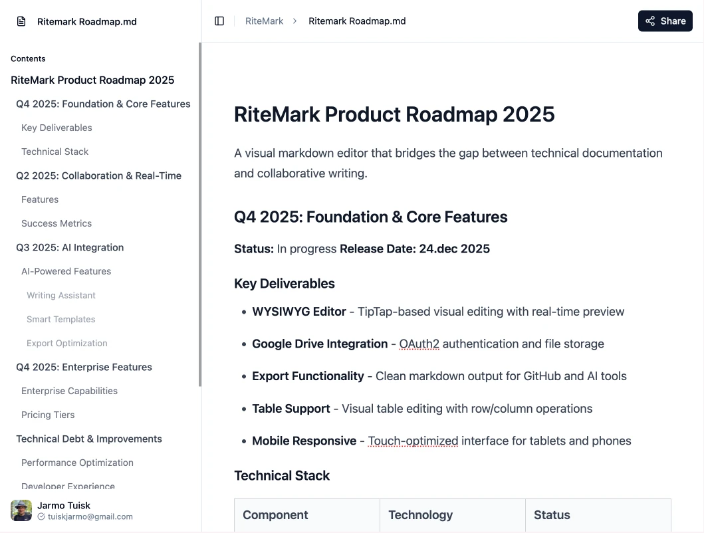

# RiteMark

**Markdown Editor for People Who Hate Markdown**

Edit documents like Google Docs. Collaborate in real-time. Export clean markdown for AI tools, GitHub, and developer workflows. No syntax required.

[](https://ritemark.netlify.app)
[](LICENSE)

---

## ✨ Features

- **📝 Visual Editing** - Format text, add headings, create lists. No raw markdown syntax. No learning curve.
- **☁️ Auto-Save to Google Drive** - Access from any device. Your files stay in your Drive. We never see your content.
- **📤 Export Clean Markdown** - Perfect for ChatGPT, Claude, GitHub, and developer workflows. One-click export.
- **👥 Real-Time Collaboration** - See edits instantly. Comment and co-author. Like Google Docs for markdown.
- **📱 Mobile-First** - Write on your phone. Edit on desktop. Seamless sync via Google Drive.

---

## 🚀 Quick Start

**Try it now:** [ritemark.netlify.app](https://ritemark.netlify.app)

1. **Sign in with Google** - Grant Drive access (we only see files you create)
2. **Start writing** - Click "New Document" or open existing `.md` files
3. **Format visually** - Use toolbar or keyboard shortcuts (no markdown syntax needed)
4. **Export markdown** - Click File menu → "Copy to Clipboard" or "Export to Word"

---

## 📸 Screenshot



*WYSIWYG markdown editing with auto-save to Google Drive*

---

## 🎯 Who Is This For?

- **Content Creators** - Need markdown for AI tools but prefer visual editing
- **Marketing Teams** - Collaborate on docs with markdown output for developers
- **GitHub Contributors** - Want to contribute docs without learning markdown syntax
- **AI-Native Users** - Write content for ChatGPT, Claude, or other AI tools

---

## 🆚 How is RiteMark Different?

### vs Notion
- ✅ **Clean markdown export** (Notion uses proprietary format)
- ✅ **Your Google Drive** (Notion stores in their cloud)
- ✅ **No vendor lock-in** - markdown works everywhere

### vs Google Docs
- ✅ **Markdown output** (Google Docs exports .docx)
- ✅ **Optimized for AI tools, GitHub** (not for printing)
- ✅ **Real-time collaboration** like Google Docs, but for markdown

### vs Other Markdown Editors
- ✅ **True WYSIWYG** - no split-screen, no syntax mode
- ✅ **Non-technical users** - designed for people who hate markdown
- ✅ **Cloud-native** - Google Drive integration, not local files

---

## 🛠️ Tech Stack

- **React 19** + **TypeScript** - Modern UI
- **TipTap** - Powerful WYSIWYG editor
- **Google Drive API** - Cloud storage
- **shadcn/ui** + **Tailwind CSS** - Beautiful components
- **Vite** - Lightning-fast builds

---

## 📚 Documentation

### For Users
- **[Getting Started Guide](docs/user-guide/getting-started.md)** - 5-minute tutorial
- **[Working with Images](docs/user-guide/images.md)** - Upload and manage images
- **[Troubleshooting](docs/user-guide/troubleshooting.md)** - Common issues and fixes

### For Developers
- **[Project Roadmap](docs/roadmap.md)** - Feature timeline and milestones
- **[Architecture Overview](docs/architecture/)** - System design (high-level)
- **[Security & OAuth](docs/security/)** - Authentication and privacy

---

## 💻 Local Development

```bash
# Clone the repository
git clone https://github.com/jarmo-productory/ritemark.git
cd ritemark/ritemark-app

# Install dependencies
npm install

# Start development server (localhost:5173)
npm run dev

# Build for production
npm run build

# Run tests
npm run test
```

---

## 🔒 Privacy & Security

- **Your Google Drive** - Documents stored in your Drive, not our servers
- **OAuth2 Authentication** - Industry-standard Google OAuth
- **Minimal Permissions** - We only access files you create with RiteMark
- **Zero-Knowledge** - Your content never touches our servers
- **Open Source** - Audit the code yourself

---

## 🤝 Contributing

We welcome contributions! Here's how to get started:

1. **Fork the repository**
2. **Create a feature branch** (`git checkout -b feature/amazing-feature`)
3. **Commit your changes** (`git commit -m 'Add amazing feature'`)
4. **Push to the branch** (`git push origin feature/amazing-feature`)
5. **Open a Pull Request**

**Before contributing:**
- Read [CLAUDE.md](CLAUDE.md) for development guidelines
- Check [open issues](https://github.com/jarmo-productory/ritemark/issues)
- Follow the existing code style

---

## 📋 Roadmap

### ✅ Completed (Current State)
- WYSIWYG markdown editor (no syntax visible)
- Google Drive integration with auto-save
- Real-time collaboration (Y.js CRDT)
- Mobile-responsive design
- Table of contents navigation
- Image upload and resize
- Tables and code blocks
- Version history and restore
- Copy to clipboard / Word export

### 🚧 In Progress
- Enhanced export templates (AI prompts, static site generators)
- Keyboard shortcuts customization
- Dark mode

### 🔮 Planned
- AI writing assistance (ChatGPT, Claude integration)
- Collaborative editing with real-time cursors
- Advanced image editing (crop, rotate, filters)
- Template library
- Browser extensions

See full roadmap: [docs/roadmap.md](docs/roadmap.md)

---

## 🐛 Reporting Issues

Found a bug? Have a feature request?

1. **Check [existing issues](https://github.com/jarmo-productory/ritemark/issues)**
2. **Create a new issue** with:
   - Browser name and version
   - Steps to reproduce
   - Expected vs. actual behavior
   - Screenshots (if applicable)

---

## 📜 License

RiteMark is open-source software licensed under the **MIT License**.

See [LICENSE](LICENSE) for details.

---

## 🌟 Show Your Support

If RiteMark helps you, consider:
- ⭐ **Star this repository** on GitHub
- 🐦 **Share on social media** (Twitter, LinkedIn)
- 💬 **Tell your team** about it
- 🐛 **Report bugs** or suggest features
- 🤝 **Contribute code** or documentation

---

## 📧 Contact

- **Email**: jarmo@productory.eu
- **Issues**: [GitHub Issues](https://github.com/jarmo-productory/ritemark/issues)
- **Company**: [Productory Services OÜ](https://www.productory.ai)

---

## 🙏 Acknowledgments

RiteMark is built with these amazing open-source projects:
- [TipTap](https://tiptap.dev/) - Extensible WYSIWYG editor
- [React](https://react.dev/) - UI framework
- [Vite](https://vitejs.dev/) - Build tool
- [shadcn/ui](https://ui.shadcn.com/) - UI components
- [Tailwind CSS](https://tailwindcss.com/) - Styling

---

**Made with ❤️ by [Productory Services OÜ](https://www.productory.ai)**

*Write visually. Export markdown. No learning curve.*
