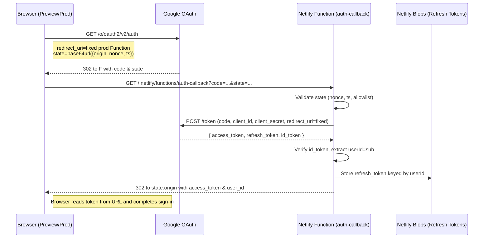

# Sprint 20 — Correct OAuth Flow with Netlify Functions

This document lays out the robust, production‑ready OAuth 2.0 Authorization Code Flow for RiteMark using Netlify Functions as the backend. It addresses the preview vs. production redirect mismatch, security concerns, and configuration specifics for Google OAuth and Netlify.

## Why This

- Preview deploys have different origins from production (e.g., `deploy-preview-11--…netlify.app`).
- Google OAuth does not allow wildcard Authorized Redirect URIs.
- Using `process.env.URL` in Functions points to the site’s primary URL (production), so redirecting based on it breaks preview flows.

## Key Principles

- Use Netlify Functions as the confidential backend: keep `CLIENT_SECRET` server-side; never expose refresh tokens to the browser.
- Derive the request origin from the request itself (`event.rawUrl`/headers), not from environment variables, when you need the current host.
- Prefer a single, fixed Authorized Redirect URI for Google (the production Function URL) and encode the return target (preview/prod) in a signed `state` parameter.
- Validate `state` (CSRF + allowlisted host) before using it to redirect the user back.

## Recommended Architecture: Single Fixed Redirect + Signed State (Preferred)

Goal: Register one redirect URI in Google (production Function). Always initiate auth with that redirect. Return the user to the initiating environment (preview or prod) using a validated `state`.

### High-level Steps

1) Browser (any deploy) initiates Google OAuth:
   - Uses a fixed `redirect_uri` pointing to production Functions: `https://ritemark.netlify.app/.netlify/functions/auth-callback`.
   - Adds `state` with Base64URL‑encoded JSON: `{ origin, nonce, ts }` (and optionally `code_challenge` if you use PKCE).
   - Requests offline access: `access_type=offline`, `prompt=consent`.

2) Google redirects to the production Function with `code` and `state`.

3) Function validates `state`:
   - Checks `nonce` (anti‑CSRF), timestamp freshness, and that `origin` is allowlisted (e.g., production or Netlify preview hosts).

4) Function exchanges `code` for tokens at Google token endpoint using the same fixed `redirect_uri`.

5) Function verifies `id_token`, extracts `sub` (user ID), and stores the `refresh_token` in Netlify Blobs keyed by user.

6) Function redirects the user back to `state.origin` with short‑lived `access_token` in the URL (or returns an ephemeral one‑time code for a follow‑up token exchange—see “Hardening”).

7) Frontend completes sign‑in, stores the access token (short‑lived), and uses Functions for refresh when needed.

### Mermaid — Auth Code Flow



## Implementation Details

### Frontend (React)

- File: `ritemark-app/src/components/WelcomeScreen.tsx:222`
- Replace dynamic callback with a fixed one, and send back the current origin via `state`:

```ts
const fixedRedirectUri = 'https://ritemark.netlify.app/.netlify/functions/auth-callback'
const state = {
  origin: window.location.origin,
  nonce: crypto.randomUUID(),
  ts: Date.now()
}

const authUrl = new URL('https://accounts.google.com/o/oauth2/v2/auth')
authUrl.searchParams.set('client_id', clientId)
authUrl.searchParams.set('redirect_uri', fixedRedirectUri)
authUrl.searchParams.set('response_type', 'code')
authUrl.searchParams.set('scope', scope)
authUrl.searchParams.set('access_type', 'offline')
authUrl.searchParams.set('prompt', 'consent')
authUrl.searchParams.set('state',
  btoa(JSON.stringify(state))
    .replace(/\+/g, '-')
    .replace(/\//g, '_')
    .replace(/=+$/, '')
)

window.location.href = authUrl.toString()
```

Notes:
- Use Base64URL for `state` (no `+`, `/`, `=`) to be URL‑safe.
- Optionally include a `code_challenge` for PKCE; keep the verifier client‑side and pass it back to the Function via `state`.

### Backend (Netlify Function)

- File: `netlify/functions/auth-callback.ts:55`
- Replace any global `FRONTEND_URL` usage with per‑request logic and validated `state`.
- Use the fixed `redirect_uri` for the token exchange.

Pseudocode:

```ts
const FIXED_REDIRECT_URI = 'https://ritemark.netlify.app/.netlify/functions/auth-callback'

export const handler: Handler = async (event) => {
  const code = event.queryStringParameters?.code
  const rawState = event.queryStringParameters?.state

  const state = parseAndValidateState(rawState) // throws on invalid
  const oauth2Client = new google.auth.OAuth2(CLIENT_ID, CLIENT_SECRET, FIXED_REDIRECT_URI)

  const { tokens } = await oauth2Client.getToken(code!)
  const userId = await verifyIdTokenAndGetSub(tokens.id_token!)

  if (tokens.refresh_token) {
    await getStore('refresh-tokens').set(userId, tokens.refresh_token)
  }

  // Final redirect to the initiating environment
  return redirect(state.origin, {
    access_token: tokens.access_token!,
    expires_in: String(60 * 60),
    token_type: 'Bearer',
    user_id: userId
  })
}
```

Origin detection tip:
- If you need to infer the current host (for fallback/error), derive it from the request: `new URL(event.rawUrl).origin` or headers (`x-forwarded-proto` + `x-forwarded-host`/`host`). Avoid `process.env.URL` for this purpose.

### Security: State Validation

- `nonce`: Generate on the client; optionally persist in local storage to compare on return.
- `ts`: Ensure freshness (e.g., within 10 minutes) to prevent replay.
- `origin`: Allowlist hosts like:
  - `ritemark.netlify.app` (production)
  - `deploy-preview-<n>--ritemark.netlify.app` (preview)
  - `http://localhost:8888` for local dev (Netlify CLI dev server)
- Reject unknown origins; this prevents open redirect issues.

### Hardening (Optional)

- Ephemeral code exchange instead of putting `access_token` in the URL:
  - Function returns `302` with `?session_code=...` to `state.origin`.
  - SPA calls `/.netlify/functions/token-exchange?session_code=...` on its own origin; Function returns access token and sets an HttpOnly cookie (this avoids tokens in the address bar and history).
- Consider PKCE for an additional binding between auth request and token exchange.

## Alternative (Not Recommended): Per‑Deploy Redirect URIs

- Using a dynamic `redirect_uri` based on the current origin requires adding every preview deploy URL to Google’s Authorized Redirect URIs. Google does not support wildcards, so this is brittle and impractical.
- If you insist on this approach for limited testing, always compute the host from `event.rawUrl` and keep the frontend and token exchange `redirect_uri` exactly matched. Expect `redirect_uri_mismatch` unless the exact preview URL is registered.

## Netlify: Using Functions Properly as Backend

- Treat Functions as your confidential backend. Keep secrets there; store refresh tokens in Netlify Blobs.
- Derive runtime host from the request, not env. Env vars are best for build‑time or context (e.g., `CONTEXT`, `DEPLOY_URL`, `DEPLOY_PRIME_URL`) but not for per‑request host.
- For debugging, log these at runtime:
  - `event.rawUrl`, `event.headers['x-forwarded-host']`, `event.headers.host`, `event.headers['x-forwarded-proto']`
  - `process.env.CONTEXT`, `process.env.URL`, `process.env.DEPLOY_URL`, `process.env.DEPLOY_PRIME_URL`

## Configuration Checklist

- Google Cloud Console (OAuth Consent + Credentials):
  - App type: Web application
  - Authorized redirect URIs:
    - `https://ritemark.netlify.app/.netlify/functions/auth-callback` (fixed)
    - `http://localhost:8888/.netlify/functions/auth-callback` (local dev via `netlify dev`)

- Netlify (`netlify.toml`):
  - Functions bundler: `esbuild` (already set)
  - Redirects to serve SPA routes to `index.html` (already present)
  - CSP allows `accounts.google.com`, `apis.google.com`, `oauth2.googleapis.com`

- Frontend:
  - Build auth URL with fixed `redirect_uri` and signed `state` (as above)
  - Continue to detect backend availability and fall back gracefully if needed

- Backend:
  - Validate `state`; exchange code with fixed `redirect_uri`
  - Store `refresh_token` in Netlify Blobs; never send it to the browser
  - Redirect to validated `state.origin` with short‑lived access token (or use the ephemeral code exchange hardening)

## References (for validation)

- Netlify Functions request shape: `event.rawUrl`, forwarded headers
- Netlify build/deploy env: `CONTEXT`, `URL`, `DEPLOY_URL`, `DEPLOY_PRIME_URL`
- Google OAuth: Authorized Redirect URIs must match exactly; wildcards are not supported for web apps

These are stable platform behaviors; consult Netlify and Google docs for exact, current details.

